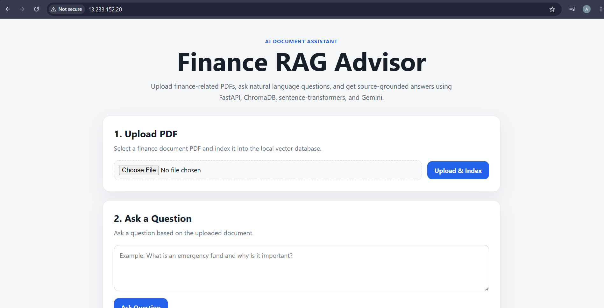
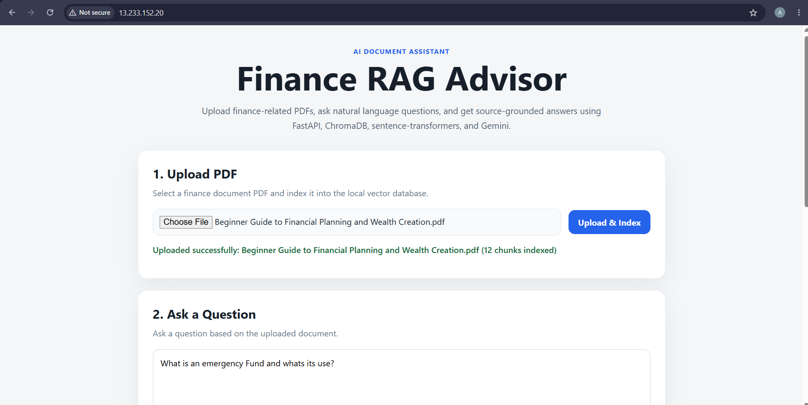
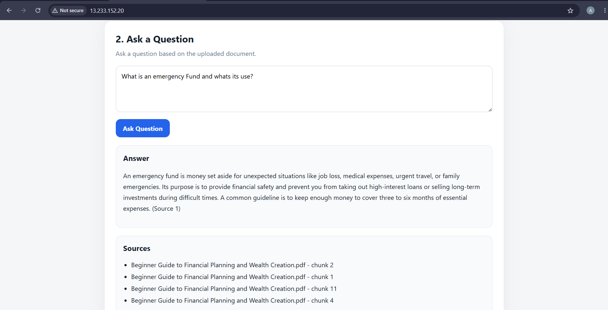
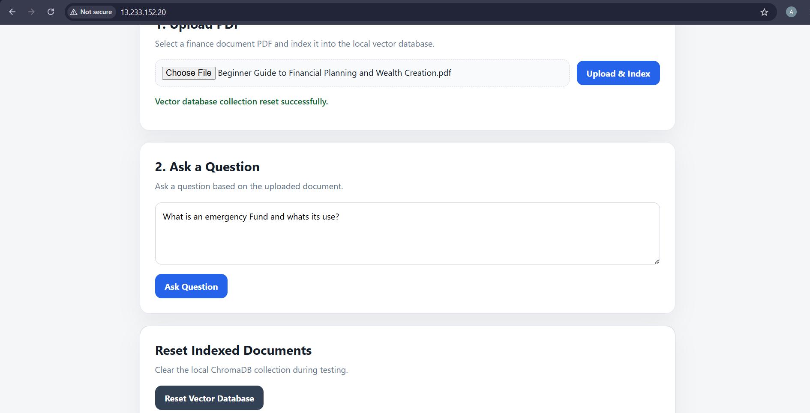
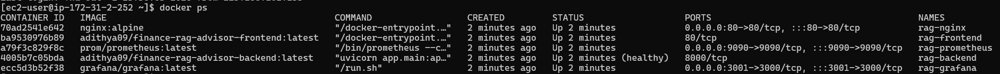
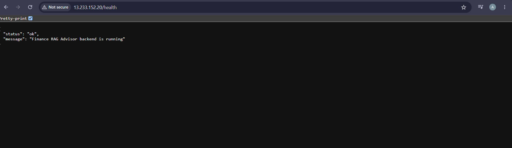
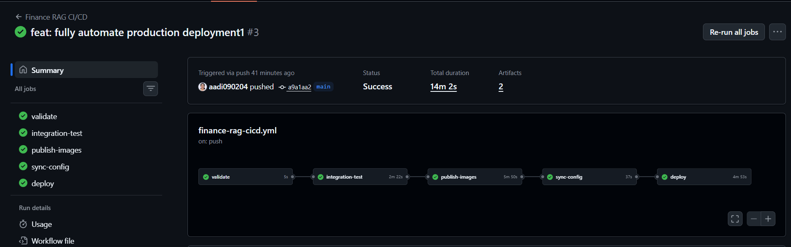
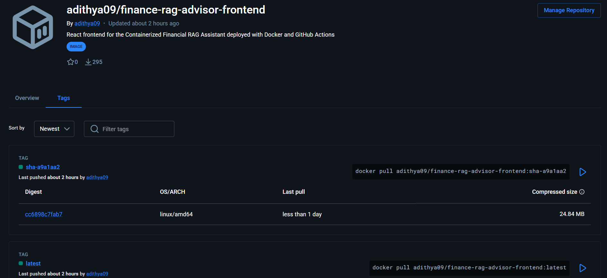
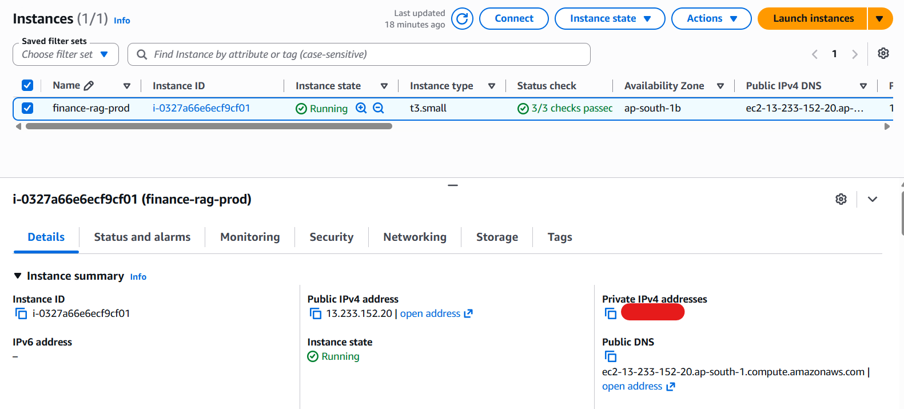

# 🚀 Financial RAG Platform

> **Production-ready AI Retrieval-Augmented Generation (RAG) Platform built with FastAPI, React, ChromaDB, Gemini, Docker, AWS EC2, Prometheus, Grafana and GitHub Actions.**

<div align="center">


</div>

---

# 📌 Overview

Financial RAG Platform is an end-to-end AI application that demonstrates both **LLM application engineering** and **production deployment practices**.

Users upload financial PDF documents, which are processed into embeddings using Sentence Transformers, stored in ChromaDB, and retrieved through semantic search. Retrieved context is supplied to Google's Gemini model to generate source-grounded answers.

The project extends beyond AI by demonstrating containerization, cloud deployment, monitoring, observability, CI/CD automation and production-style operations.

---

# ✨ Highlights

### 🤖 AI Engineering

- Retrieval-Augmented Generation (RAG)
- Financial document question answering
- ChromaDB vector database
- Sentence Transformer embeddings
- Semantic similarity search
- Gemini grounded responses
- Source citation display

### ☁️ Cloud & DevOps

- Dockerized services
- Docker Compose orchestration
- AWS EC2 deployment
- Nginx reverse proxy
- GitHub Actions CI/CD
- Docker Hub image publishing
- Prometheus monitoring
- Grafana dashboards
- Health checks
- Persistent storage

---

# 🏗 Architecture

```text
GitHub
   │
GitHub Actions
   │
Docker Build & Push
   │
Docker Hub
   │
AWS EC2
   │
Docker Compose
   │
┌─────────────┬───────────────┐
│             │               │
React      FastAPI      Prometheus
              │              │
        RAG Pipeline    Grafana
              │
Sentence Transformers
              │
          ChromaDB
              │
          Gemini API
```

---

# 🧠 RAG Pipeline

```text
PDF Upload
    ↓
Text Extraction
    ↓
Chunking
    ↓
Embedding Generation
    ↓
ChromaDB
    ↓
Semantic Retrieval
    ↓
Prompt Construction
    ↓
Gemini
    ↓
Grounded Response
```

---

# ⚙ Technology Stack

| Area | Technology |
|------|------------|
| Backend | FastAPI, Python |
| Frontend | React, Vite |
| LLM | Gemini |
| Embeddings | Sentence Transformers |
| Vector Database | ChromaDB |
| Containers | Docker |
| Orchestration | Docker Compose |
| CI/CD | GitHub Actions |
| Cloud | AWS EC2 |
| Monitoring | Prometheus |
| Dashboards | Grafana |
| Reverse Proxy | Nginx |

---

# 📸 Demonstration

## Live Application on AWS


## Upload Financial Document


## AI Response with Source Chunks


## Reset Vector Database


## Production Containers


## Production Health Endpoint


## GitHub Actions Pipeline


## Docker Hub Published Images


## Prometheus Targets


## Grafana Dashboard


## AWS EC2 Deployment


---

# 🚀 Running Locally

```bash
git clone https://github.com/aadi090204/financial-rag-platform.git
cd financial-rag-platform
cp .env.example .env
docker compose up -d --build
```

Add your Gemini API key to `.env`.

---

# 🌐 Services

| Service | URL |
|---------|-----|
| Frontend | http://localhost |
| Backend Health | /health |
| Swagger | /docs |
| Metrics | /metrics |
| Prometheus | localhost:9090 |
| Grafana | localhost:3001 |

---

# 🔄 CI/CD Workflow

Every push to `main` automatically:

1. Validates Docker Compose.
2. Builds the application.
3. Runs integration checks.
4. Builds backend and frontend images.
5. Publishes images to Docker Hub.
6. Synchronizes production configuration.
7. Deploys to AWS EC2.
8. Performs deployment health verification.
9. Removes dangling Docker images.

---

# 📈 Monitoring

The backend exports Prometheus metrics which are scraped and visualized through Grafana dashboards.

Metrics include:

- Request count
- Request latency
- Endpoint status
- Health checks
- Container status

---

# 🛠 Engineering Challenges

- Docker image lifecycle management on limited EC2 storage
- Backend readiness checks during deployment
- Reverse proxy configuration
- Persistent ChromaDB volumes
- CI/CD automation
- Production health verification
- Monitoring integration
- Container networking

---

# 📚 Key Learnings

- Retrieval-Augmented Generation
- LLM application architecture
- Semantic search
- Vector databases
- Production APIs with FastAPI
- Docker & Docker Compose
- GitHub Actions
- AWS EC2 deployment
- Prometheus & Grafana
- Production troubleshooting

---

# 🚀 Future Improvements

- Kubernetes deployment
- AWS ECS/EKS
- Terraform
- Redis caching
- JWT authentication
- OpenTelemetry tracing
- Horizontal scaling

---

# 👨‍💻 Author

**Adithya Anil**

Software Engineer • AI Engineering • DevOps • Cloud

GitHub: https://github.com/aadi090204
LinkedIn: https://www.linkedin.com/in/adithya-anil/
