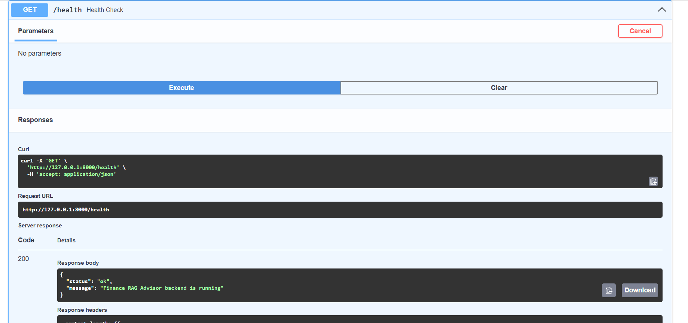
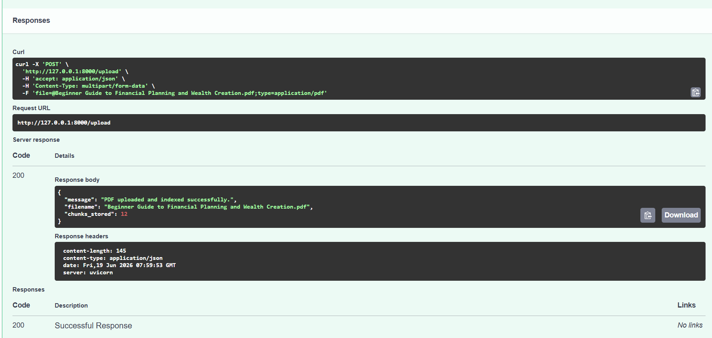
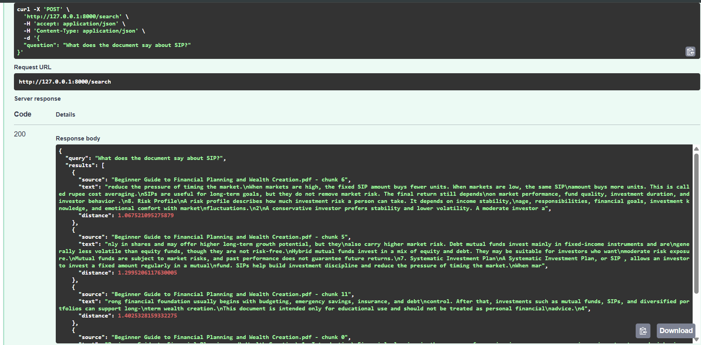

# Finance RAG Advisor

A RAG-based financial document assistant built with FastAPI, ChromaDB, sentence-transformers, and Gemini. The system allows users to upload finance-related PDF documents, search them semantically, and ask source-grounded questions.

## Why I Built This

I built this project to understand how AI applications can answer questions from domain-specific documents without relying only on general model knowledge. The main focus was to explore PDF ingestion, embeddings, vector search, retrieval quality, source-grounded answering, and fallback handling when LLM generation is unavailable.

## Features

* Upload and index PDF documents
* Extract text from PDFs using `pypdf`
* Split documents into searchable chunks
* Generate embeddings using `sentence-transformers`
* Store and retrieve document chunks using ChromaDB
* Search documents semantically using a natural language query
* Generate source-grounded answers using Gemini
* Return source chunks used for each answer
* Reset indexed documents during testing
* Fallback retrieval mode when LLM generation is unavailable or quota-limited

## Tech Stack

* Python
* FastAPI
* Uvicorn
* ChromaDB
* sentence-transformers
* Gemini API
* pypdf
* python-dotenv

## API Endpoints

| Method | Endpoint           | Purpose                           |
| ------ | ------------------ | --------------------------------- |
| GET    | `/health`          | Check backend health              |
| POST   | `/upload`          | Upload and index a PDF            |
| POST   | `/search`          | Retrieve relevant document chunks |
| POST   | `/ask`             | Ask a source-grounded question    |
| DELETE | `/documents/reset` | Reset indexed documents           |

## Project Architecture

```text
PDF Upload
   ↓
Text Extraction
   ↓
Text Chunking
   ↓
Embedding Generation
   ↓
ChromaDB Vector Storage
   ↓
Semantic Retrieval
   ↓
Gemini Answer Generation
   ↓
Answer + Source Chunks
```

## How to Run Locally

Clone the repository:

```bash
git clone https://github.com/aadi090204/Finance-rag-advisor.git
cd Finance-rag-advisor/backend
```

Create and activate a virtual environment:

```bash
python -m venv venv
venv\Scripts\activate
```

Install dependencies:

```bash
pip install -r requirements.txt
```

Create a `.env` file inside the `backend` folder:

```env
GEMINI_API_KEY=your_gemini_api_key_here
```

Start the FastAPI server:

```bash
uvicorn app.main:app --reload
```

Open the API documentation:

```text
http://127.0.0.1:8000/docs
```

## Example Questions

```json
{
  "question": "What is an emergency fund and why is it important?"
}
```

```json
{
  "question": "What does the document say about SIP?"
}
```

```json
{
  "question": "What investment risks are mentioned?"
}
```

## Screenshots

### Health Check



### PDF Upload



### Semantic Search



### Source-Grounded AI Answer


## What Went Wrong

While building the project, I ran into a few practical issues:

1. The first Gemini model name I used, `gemini-1.5-flash`, was not available for my API version.
2. Another model returned a quota error, so the backend needed fallback handling instead of crashing.
3. Raw character-based chunking sometimes split sentences awkwardly.
4. PDF extraction quality depended on whether the PDF contained real text or scanned images.

## How I Fixed It

* Added error handling around Gemini answer generation.
* Added a fallback retrieval mode that returns the most relevant document chunks if LLM generation fails.
* Added a `/search` endpoint to debug retrieval separately from answer generation.
* Added `/documents/reset` to clear indexed documents during testing.
* Used source chunk references to make answers more transparent.

## What I Learned

* RAG quality depends heavily on retrieval quality, not only on the LLM.
* Having a separate semantic search endpoint makes debugging easier.
* LLM APIs can fail due to quota, model availability, or provider changes, so fallback behavior is important.
* Source-grounded answers are more trustworthy than generic chatbot responses.
* Chunking strategy affects how accurately relevant information is retrieved.

## Future Improvements

* Add React frontend
* Improve chunking using paragraph-aware or sentence-aware splitting
* Add authentication for uploaded documents
* Add Dockerfile and Docker Compose
* Add Prometheus metrics for request latency and error count
* Add evaluation dataset for testing answer quality
* Add support for multiple LLM providers
* Add document deletion by filename

## Disclaimer

This project is for educational purposes only. It does not provide investment advice or recommend any financial product.
